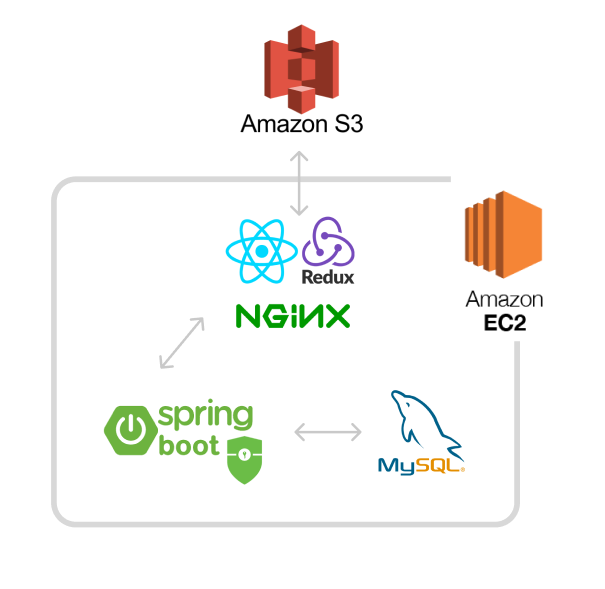
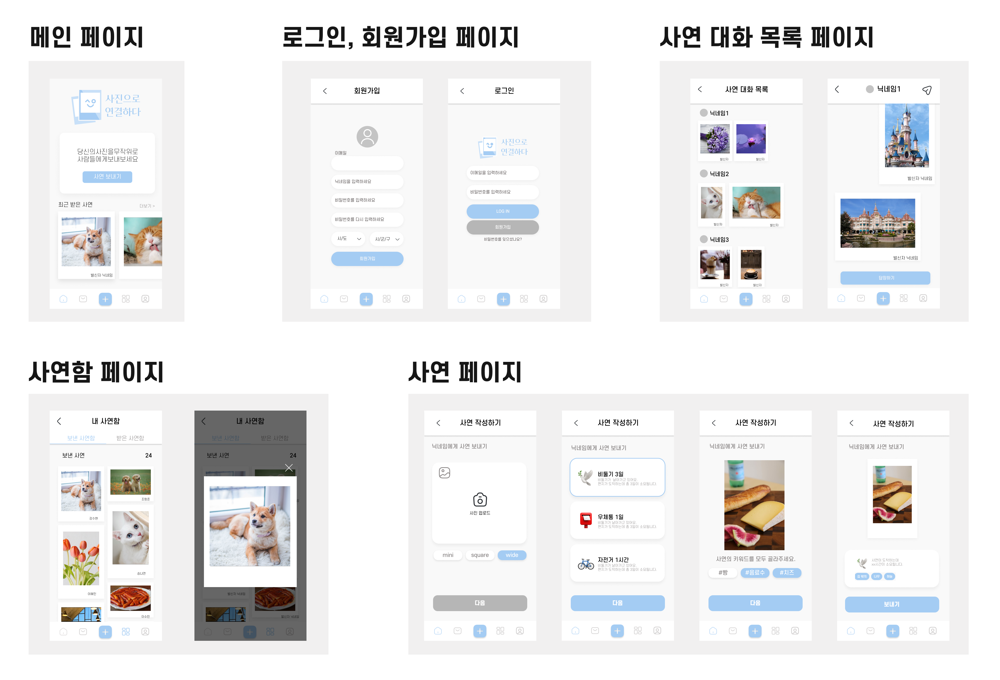
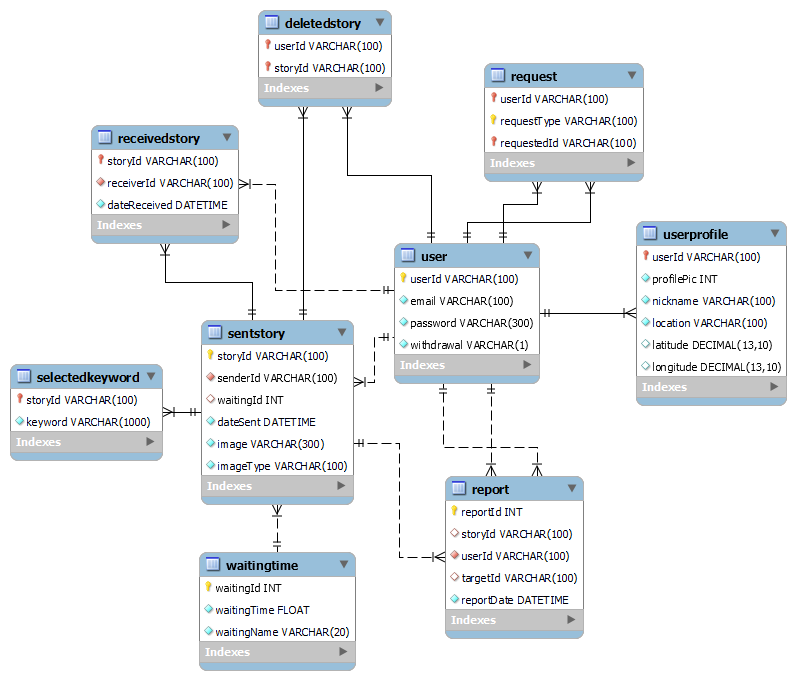
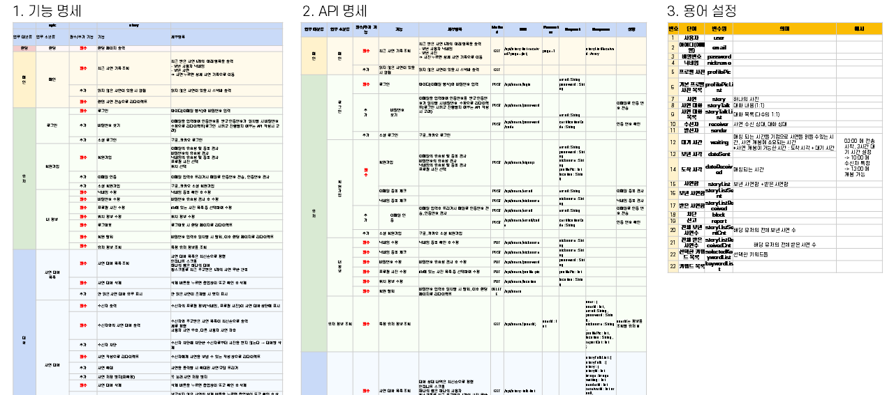

<br>

<br>

# 사진으로 연결하다, 사연

> 사진을 중심으로 다른 사용자와 편지를 주고받을 수 있는 펜팔 서비스

<br>

## 팀 소개

> 특화 프로젝트 2반 4팀

- 조항준 | 👍 팀장 | ☕ FE | 🤖 AI
- 강수현 | 🖐 팀원 | ☕ FE | 💠 JIRA | 📃 문서
- 승나연 | 🖐 팀원 | ⚡ BE | 🚀 배포 | 🎬 UCC
- 이수민 | 🖐 팀원 | ☕ FE | 🤖 AI
- 이혜민 | 🖐 팀원 | ⚡ BE | 🚀 배포 | 🦊 GIT

<br>

## 기획 의도 및 배경

- 코로나로 인해 현대인에게 일상적인 감정이 된 외로움 가중
- 숏폼 컨텐츠, 간단히 이용할 수 있는 서비스에 대한 수요 증가
- 아날로그 감성에 빠진 MZ세대 
- 상대적 박탈감, 정보 과부화 등 기존 SNS에 피로감을 느끼는 사람들 증가

<br>

전체 기획서는 [링크](https://hana-275-programming.notion.site/42f7b87599ad4cb482415cad1e876b09)에서 확인하실 수 있습니다.

<br>

## 서비스 목표

- 만나보지 못한 새로운 사람과의 색다른 소통의 장
- 과도한 정보 제공으로 인한 피로감 없이 편하게 소통할 수 있는 공간
- 아날로그 감성을 담은 소통의 공간
- 사용자가 원하는 사진을 교환하고, 원치 않는 사진은 거를 수 있는 사용자 맞춤 서비스

<br>

## 대상 타겟

- 펜팔과 편지라는 아날로그 감성에 매력을 느끼는 사람들
- 현대 SNS에 피로감을 느껴 색다른 SNS를 이용하고자 하는 사람들
- 텍스트보다 이미지를 통한 소통이 익순한 MZ세대

<br>

## 기술 스택

### 🌏 환경 버전

- 형상관리

  - Jira


  - Gitlab


  - Mattermost

  - Webex

  - Notion

- 개발 환경

  - OS
    - Windows 10

  - IDE
    - STS 3.9.14
    - Visual Studio Code 1.63.2
    - Figma

  - Database
    - MySQL (8.0.28)

  - Server
    - AWS EC2 (Ubuntu 20.04 LTS)

  - Browser
    - Chrome 97.0.4692.71 64bit


<br>

### ⛏ 기술 스택

- Backend

  - Java

  - Spring-Boot

  - MySQL


- Frontend

  - React

  - Redux

  - TypeScript

  - CSS, HTML5

  - Node.js


- DevOps

  - NGiNX

  - AWS


<br>

## 주요 기능


- 랜덤으로 사진 보낼 시, 원하는 사진을 올리면 AI가 키워드 추출
- 마음에 드는 키워드 선택 후 사연을 보내면 유사한 키워드를 선택한 사연과 매칭

<br>


- 매칭된 사람과는 소통 지속 가능
- 원하는 사진을 올리면 AI가 키워드를 추출하고, 키워드를 선택
- 비둘기/우체통/자전거 중 하나를 선택하여 보내면 거리 기반, 전송 수단 기반으로 전송 시간이 결정됨
- 상대방은 결정된 전송 시간 이후 사연 열람 가능

<br>


- 사연함에서 보낸 사연함과 받은 사연함 확인 가능
- 사연 대화 목록에서는 매칭된 상대와 나눈 사연들을 확인 가능
- 사연이 아직 도착하지 않았을 경우 시간 안내와 함께 열람 불가 표시

<br>

## 프로젝트 구성도

### 🗺 아키텍처



<br>

### 📂 와이어 프레임



<br>

전체 와이어 프레임은 [링크](https://www.figma.com/file/zrz07ZKYzYX4qo8KxklnyI/%EC%82%AC%EC%97%B0?node-id=0%3A1)에서 확인하실 수 있습니다.

<br>

### 📄 ERD



<br>

### 📝 명세서 작성

**사연**에서 사용될 용어, 필요한 기능과 그에 따른 API 명세서 작성


<br>

전체 명서서는 [링크](https://docs.google.com/spreadsheets/d/1wbF4sDwKmWXGpWsN2lZHAsYuTRvs0hBda7ixyHsP7wk/edit?usp=sharing)에서 확인하실 수 있습니다.

<br>

### 🤙 컨벤션

#### JIRA

- 에픽: 명세의 `대분류`를 기준으로 작성합니다.
- 스토리: 명세의 `기능`을 기준으로 작성합니다.
- 테스크: 각자 맡은 스토리에 대하여 필요한 작업을 작성합니다.
  - 백엔드는 ⚡, 프론트엔드는 ☕ 이모지를 사용하여 시각적으로 명확하게 구분될 수 있게 합니다.
  - 스토리포인트는 8을 넘지 않도록 합니다.

#### GIT

**브랜치**

- `master` : 라이브 서버에 제품으로 출시되는 브랜치.
- `develop` : 다음 출시 버전을 대비하여 개발하는 브랜치.
- `feature/{epic 이름}` : 기능 개발 브랜치. `develop` 브랜치에 들어갑니다.
- `{story 이름}/backend`, `{story 이름}/frontend` : `feature/{epic 이름}` 브랜치에 들어갑니다다.
- `release` : 다음 버전 출시를 준비하는 브랜치. `develop` 브랜치를 `release` 브랜치로 옮긴 후 QA, 테스트를 진행하고 `master` 브랜치로 합칩니다.
- `hotfix` : `master` 브랜치에서 발생한 버그를 수정하는 브랜치.

**네이밍**

1. master branch, develop branch

   - master와 develop 브랜치는 본래 이름 그대로 사용

2. feature branch

   - feature 브랜치는 epic 이름으로 사용
   - 하위 브랜치는 story 이름부터 작성

   ```
   {story 이름}/{backend||frontend}
   // login 브랜치 -> find-password/frontend
   ```

   - 어떤 이름도 가능하다. 단, `master`, `develop`, `release-...`, `hotfix-...` 같은 이름은 사용할 수 없다.

3. release branch

   - `release-...` 형식 ex) release-1.2

4. hotfix branch

   - `hotfix-...` 형식 ex) hotfix-1.2.1

**커밋**

```
TYPE: {이모지} 커밋내용

ex) FEAT: ✨ 로그인 기능 추가
```

**커밋 유형 종류**

```
FEAT: ✨ 새로운 기능 추가
FIX: 🐛 버그 수정 
DOCS: 📚 문서 수정
CHORE: 📝 그 외 자잘한 작업
TEST: ☔️ 테스트 코드
BUILD: 🏹 시스템 또는 외부 종속성에 영향을 미치는 변경사항 (npm, gulp, yarn 레벨)
CI: 🎡 CI관련 설정
STYLE: 💄 코드 의미에 영향을 주지 않는 변경사항 (포맷, 세미콜론 누락, 공백 등)
REFACTOR: 💡 성능 개선
MERGE: 🤝 기능 개발 후 브랜치 병합
DOCKER: 🐳 도커 구성
DB: 🐬 MySQL 데이터베이스 특정 (마이그레이션, 스크립트, 확장 등)
```

<br>

전체 컨벤션은 [링크](https://hana-275-programming.notion.site/5cf26a67a0294d01a285a12443672917)에서 확인하실 수 있습니다.

<br>

<br>

**더 자세한 내용은 [사연 Notion](https://hana-275-programming.notion.site/SSAFY-2-8bf2375fb5c04218b7075c21df0c4a98) 에서 확인해 주세요.**
