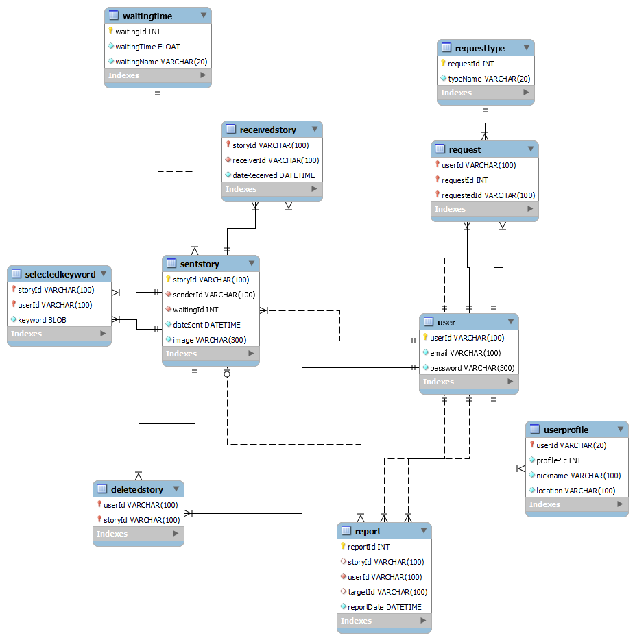

# 사연, 사진으로 연결하다

> ** 사연은 사진을 중심으로 다른 사용자와 편지를 주고받을 수 있는 펜팔 서비스입니다.**


<br>

## 기획 의도
- 현대인에게 일상적인 감정이 된 외로움은 [코로나로 인해 더욱 심해져](https://health.chosun.com/site/data/html_dir/2021/09/09/2021090900962.html)왔습니다. 이러한 시기에 **사연**은 타인과 소통할 수 있는 새로운 장소를 제공하고자 합니다.
- 자투리 시간에 [간단히 이용할 수 있는 서비스, 숏폼 컨텐츠가 폭발적인 인기를 얻고 있는](https://www.newspim.com/news/view/20200406000800) 현시대에 맞추어 **사연**은 짧은 시간에 최소화된 조작으로 간편하게 사용할 수 있는 서비스를 제공합니다.
- **사연**은 [텍스트보다 이미지를 통한 소통에 익숙하고](http://www.iconsumer.or.kr/news/articleView.html?idxno=21119) 새로이 인기를 얻고 있는 [아날로그 감성을 찾는](http://www.koreanewstoday.co.kr/news/articleView.html?idxno=66036) MZ 세대를 겨냥한 컨텐츠를 제공합니다.
- SNS 피로감을 호소하는 사람들이 많아지고 있습니다. **사연**은 [상대적 박탈감, 정보 과부화 등 여러 요인으로 인해 기존의 SNS에 피로감을 느끼는 사람들](https://www.koreascience.or.kr/article/JAKO201819352299454.pdf)에게 최소한의 정보로 타인과 소통할 수 있는 새로운 SNS 서비스를 제공합니다.

따라서 **사연**은 이러한 사람들을 위한 서비스입니다.
- 텍스트보다 이미지를 통한 소통이 익숙한 사람들
- 현대 SNS에 피로감을 느껴 색다른 SNS를 이용하고자 하는 사람들
- 펜팔과 편지라는 아날로그, 레트로 감성에 매력을 느끼는 사람들

또한 **사연**은 다음을 목표로 합니다.
- 만나보지 못한 새로운 사람과의 색다른 소통의 장
- 과도한 정보 제공으로 인한 피로감 없이 소통할 수 있는 공간
- 아날로그 감성을 담은 소통의 공간
- 사용자가 원하는 사진을 교환하고, 원하지 않는 사진을 보지 않을 수 있는 사용자 맞춤 서비스를 위한 AI 필터링

<br>

전체 기획서는 [링크](https://hana-275-programming.notion.site/42f7b87599ad4cb482415cad1e876b09)에서 확인하실 수 있습니다.

<br>

## 명세서 작성
**사연**에서 사용될 용어, 필요한 기능과 그에 따른 API 명세서를 다음과 같이 작성하였습니다.


<br>

전체 명서서는 [링크](https://docs.google.com/spreadsheets/d/1wbF4sDwKmWXGpWsN2lZHAsYuTRvs0hBda7ixyHsP7wk/edit?usp=sharing)에서 확인하실 수 있습니다.

<br>

## 컨벤션
### JIRA
- 에픽: 명세의 `대분류`를 기준으로 작성합니다.
- 스토리: 명세의 `기능`을 기준으로 작성합니다.
- 테스크: 각자 맡은 스토리에 대하여 필요한 작업을 작성합니다.
    - 백엔드는 ⚡, 프론트엔드는 ☕ 이모지를 사용하여 시각적으로 명확하게 구분될 수 있게 합니다.
    - 스토리포인트는 8을 넘지 않도록 합니다.

### GIT
#### 브랜치
- `master` : 라이브 서버에 제품으로 출시되는 브랜치.
- `develop` : 다음 출시 버전을 대비하여 개발하는 브랜치.
- `feature/{epic 이름}` : 기능 개발 브랜치. `develop` 브랜치에 들어갑니다.
- `{story 이름}/backend`, `{story 이름}/frontend` : `feature/{epic 이름}` 브랜치에 들어갑니다다.
- `release` : 다음 버전 출시를 준비하는 브랜치. `develop` 브랜치를 `release` 브랜치로 옮긴 후 QA, 테스트를 진행하고 `master` 브랜치로 합칩니다.
- `hotfix` : `master` 브랜치에서 발생한 버그를 수정하는 브랜치.

**네이밍**
1. master branch, develop branch

    - master와 develop 브랜치는 본래 이름 그대로 사용

2.  feature branch

    - feature 브랜치는 epic 이름으로 사용
    - 하위 브랜치는 story 이름부터 작성

    ```
    {story 이름}/{backend||frontend}
    // login 브랜치 -> find-password/frontend
    ```

    - 어떤 이름도 가능하다. 단, `master`, `develop`, `release-...`, `hotfix-...` 같은 이름은 사용할 수 없다.

3. release branch

    - `release-...` 형식 ex) release-1.2

4. hotfix branch

    - `hotfix-...` 형식 ex) hotfix-1.2.1

#### 커밋

```
TYPE: {이모지} 커밋내용

ex) FEAT: ✨ 로그인 기능 추가
```
**커밋 유형 종류**
```
FEAT: ✨ 새로운 기능 추가
FIX: 🐛 버그 수정 
DOCS: 📚 문서 수정
CHORE: 📝 그 외 자잘한 작업
TEST: ☔️ 테스트 코드
BUILD: 🏹 시스템 또는 외부 종속성에 영향을 미치는 변경사항 (npm, gulp, yarn 레벨)
CI: 🎡 CI관련 설정
STYLE: 💄 코드 의미에 영향을 주지 않는 변경사항 (포맷, 세미콜론 누락, 공백 등)
REFACTOR: 💡 성능 개선
MERGE: 🤝 기능 개발 후 브랜치 병합
DOCKER: 🐳 도커 구성
DB: 🐬 MySQL 데이터베이스 특정 (마이그레이션, 스크립트, 확장 등)
```

<br>

전체 컨벤션은 [링크](https://hana-275-programming.notion.site/5cf26a67a0294d01a285a12443672917)에서 확인하실 수 있습니다.

<br>

## 와이어 프레임


<br>

전체 와이어 프레임은 [링크](https://www.figma.com/file/zrz07ZKYzYX4qo8KxklnyI/%EC%82%AC%EC%97%B0?node-id=0%3A1)에서 확인하실 수 있습니다.

<br>

## ERD



<br>

## 기술 스택

#### 이슈관리

- Jira

#### 형상관리

- Gitlab

#### 커뮤니케이션

- Mattermost
- Webex
- Notion

#### 개발 환경

- OS
  - Windows 10
- IDE
  - STS 3.9.14
  - Visual Studio Code 1.63.2
  - Figma
- Database
  - MySQL Workbench

- Server

- Browser
  - Chrome 97.0.4692.71 64bit

#### 상세내용

- Backend
  - Java (Open-JDK Zulu 8.33.0.1 / 11.0.X)
- Frontend
  - HTML5, CSS3, JavaScript(ES6)
  - React 17.0.2, Redux
  - Node.js 16.13.0


<br>

## 팀 소개

- 조항준 | 👍 팀장 | ☕ FE | 🤖 AI
- 강수현 | 🖐 팀원 | ☕ FE | 💠 JIRA | 📃 문서
- 승나연 | 🖐 팀원 | ⚡ BE | 🚀 배포
- 이수민 | 🖐 팀원 | ☕ FE | 🤖 AI
- 이혜민 | 🖐 팀원 | ⚡ BE | 🚀 배포 | 🦊 GIT

<br>

## [사연 Notion](https://hana-275-programming.notion.site/SSAFY-2-8bf2375fb5c04218b7075c21df0c4a98)
