# 시연 시나리오

## 1. 랜딩 페이지

- 랜딩 페이지를 통해 사용자에게 `사연`이 무엇인지, `사연`이 어떠한 서비스인지를 안내합니다.

| 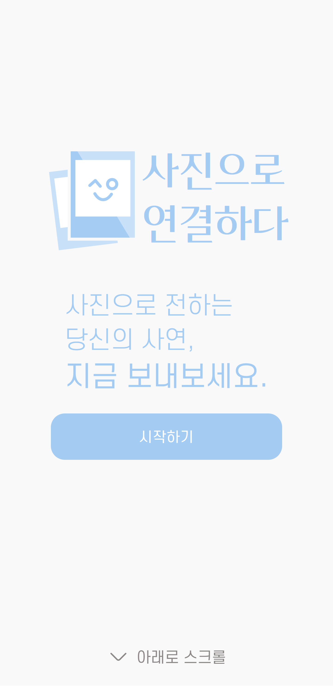 |  | 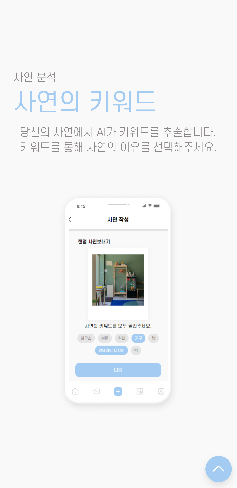 |
| ------------------------------------------ | ------------------------------------------ | ------------------------------------------ |
| 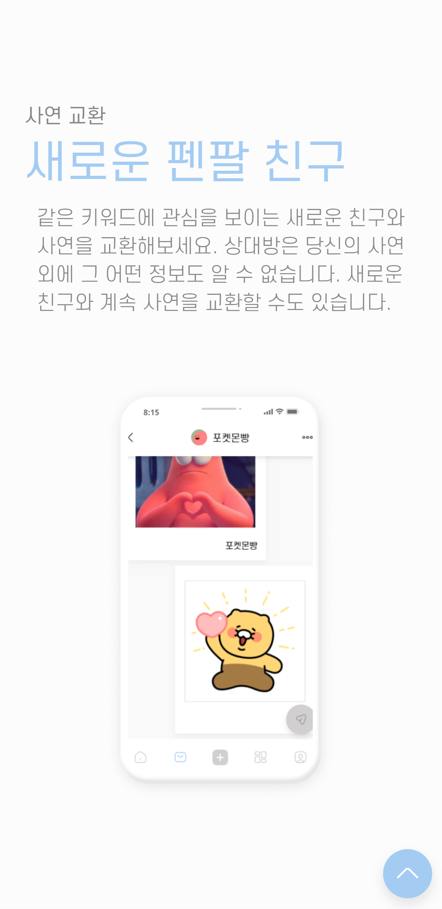 | 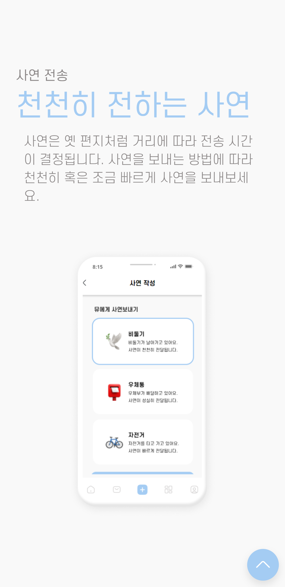 | 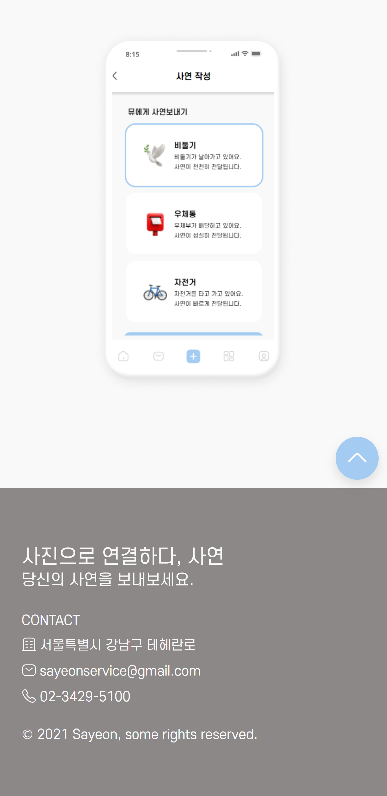 |

- 시작하기를 누르면 메인 페이지로 이동합니다.

 

## 2. 계정 페이지

| 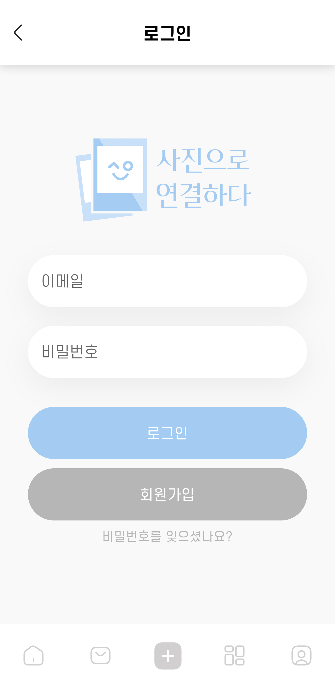 | 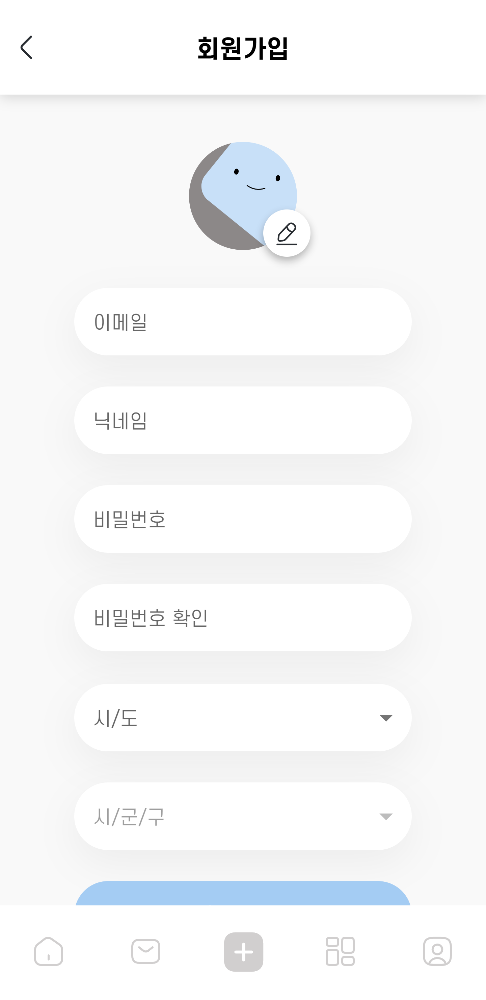 |  |
| ------------------------------------------ | ------------------------------------------ | ------------------------------------------ |

> `사연`은 회원제로 운영됩니다. 서비스를 이용하기 위해 로그인을 해주세요.

## 2-1. 로그인

- 사용자는 이메일과 비밀번호를 통해 로그인합니다.

## 2-2. 회원가입

- 사용자는 회원가입시 `사연`에서 제공하는 36종의 프로필 사진 중 한 가지를 선택할 수 있습니다.
- 사용자는 회원가입시 위치정보를 입력해야 합니다. 이는 이후 `사연` 전송시 소요되는 시간 계산에 이용됩니다.

## 2-3. 비밀번호 찾기

- 사용자는 이메일을 입력하여 새로운 임시 비밀번호를 발급받을 수 있습니다. 가입한 이메일을 통해 임시 비밀번호가 전송됩니다.
    - 메일 예시
      
        

 

# 3. 메인 페이지

| 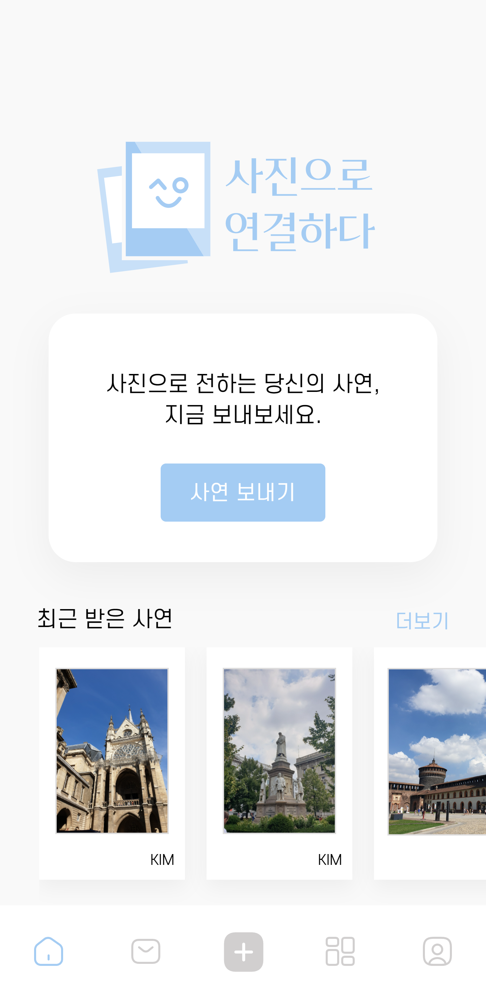 | 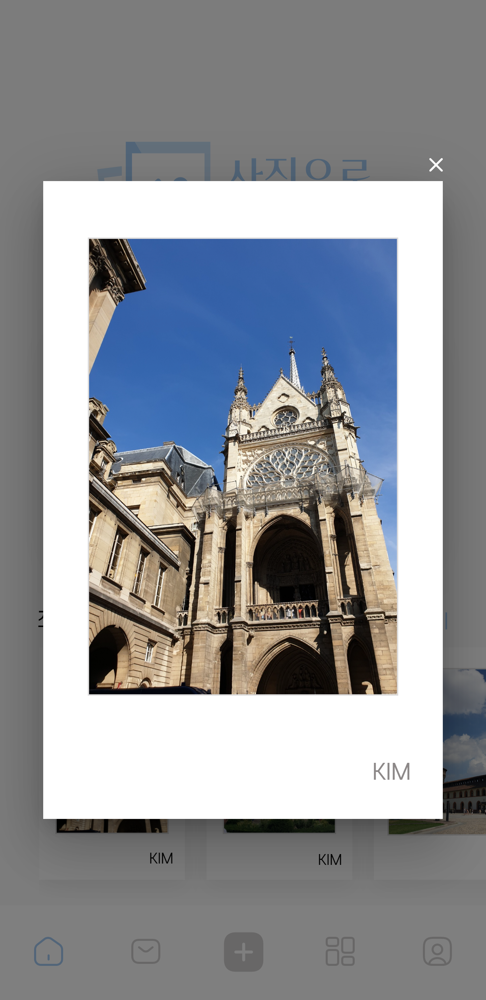 |
| -------------------------------------------- | -------------------------------------------- |

- 메인페이지는 최근 활동 내역과 빠르게 사연 작성을 할 수 있도록 돕는 버튼으로 간단하게 구성되어 있습니다.
- 최근 받은 사연을 통해 가장 최근에 받은 세 개의 `사연`을 살펴볼 수 있으며, 모든 `사연`은 클릭시 더 크게 볼 수 있습니다.

-  `사연 보내기`를 누르면 랜덤 사연을 보낼수 있는 사연 작성 페이지로 이동합니다.

  `더보기`를 누르면 사용자의 받은 사연함으로 이동할 수 있습니다.

 

# 4. 사연 대화 목록 페이지

- 사용자가 `사연`에서 만난 다른 친구와 나눈 대화를 **사연 대화**라 합니다. **사연 대화 목록**은 이러한 **사연 대화**의 목록을 확인할 수 있는 곳입니다.
- 각각의 사연 대화는 친구의 프로필 사진, 닉네임 그리고 최근 친구와 나눈 세 개의 `사연`으로 확인할 수 있습니다.
- 각각의 사연 대화는 최근에 사연을 주고받은 순으로 정렬되어 표시됩니다.

- 사연 대화를 클릭하면 해당 친구와 나눈 `사연`을 볼 수 있는 사연 대화 페이지로 이동합니다. 

 

# 5. 사연 대화 페이지

## 5-1. 사연 대화

| 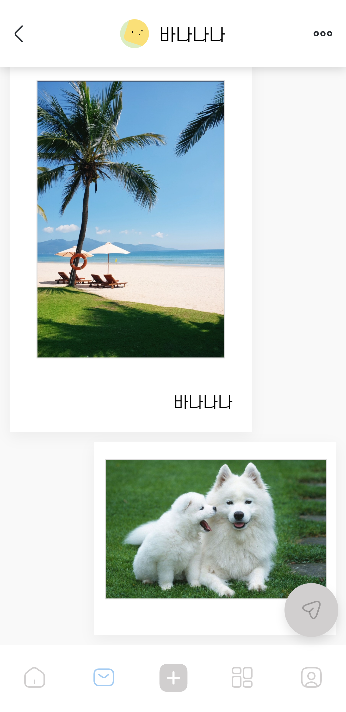 |  |
| -------------------------------------------- | -------------------------------------------- |

- 사연 대화에서 상대방과 나눈 `사연` 대화 이력을 볼 수 있습니다. 사용자가 보낸 `사연`은 오른쪽, 상대방이 보낸 `사연`은 왼쪽에 정렬됩니다.
- 번갈아가며 대화를 할 수 있도록 상대방이 `사연`을 보낸 이후에만 답장을 보낼 수 있습니다.

## 5-2. 사연

|  | 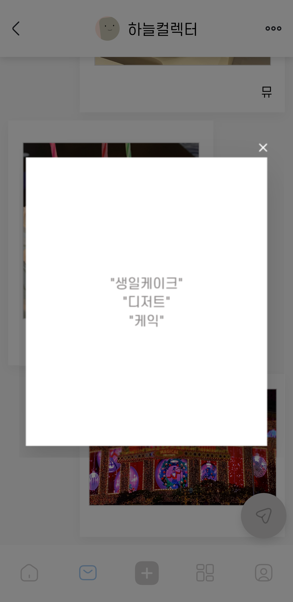 |
| -------------------------------------------- | -------------------------------------------- |

- `사연`을 클릭하면 확대가 가능합니다.
- 확대된 `사연`을 다시 클릭하면 `사연`이 뒤집어지고, 선택되었던 키워드가 표시됩니다.

## 5-3. 사연 열람

| 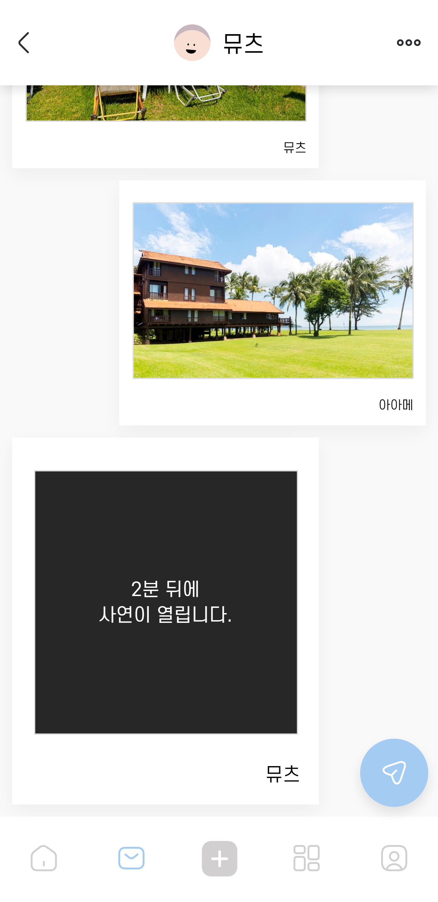 | 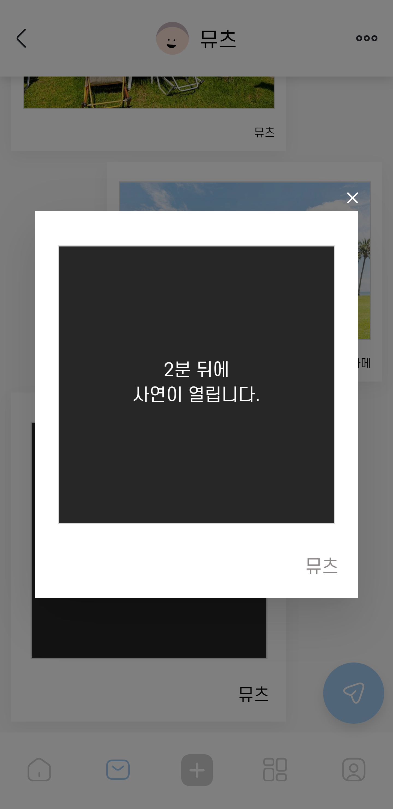 |
| -------------------------------------------- | -------------------------------------------- |

- `사연`을 보낸 사용자가 결정한 사연 전달 시간이 현재 시간보다 미래인 경우 사연을 확인하기 위해서는 조금 더 기다려야 합니다.

- 남은 시간이 1시간 이상인 경우 남은 시각이 표시됩니다.
- 남은 시간이 1시간 미만인 경우 남은 분이 표시됩니다.

## 5-4. 사연 대화 관리

| 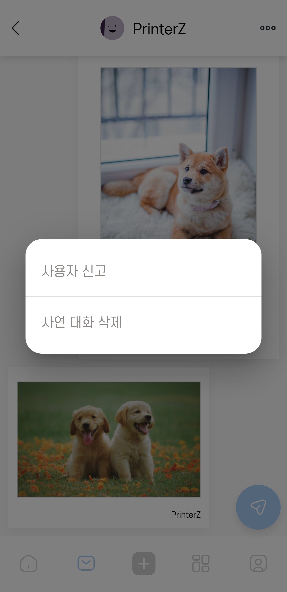 |  | 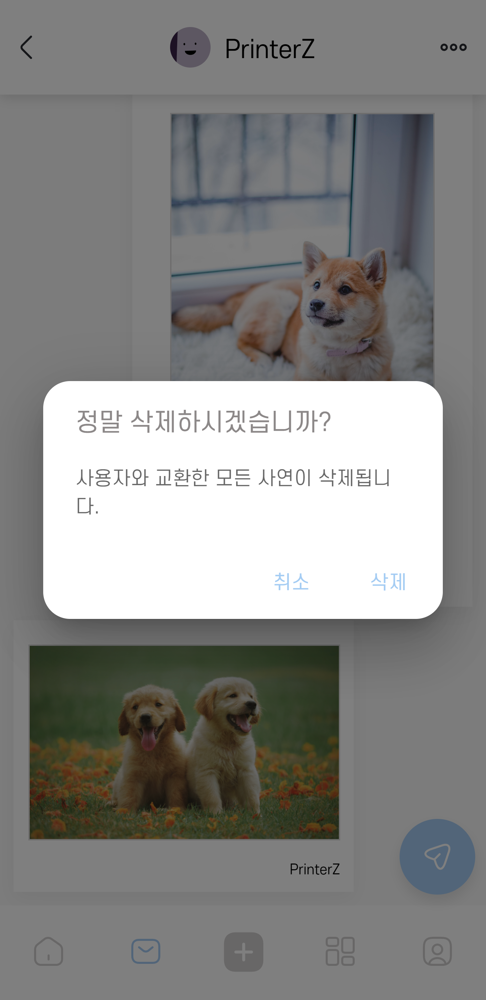 |
| -------------------------------------------- | -------------------------------------------- | -------------------------------------------- |

- 사연 대화 헤더바 우측의 버튼을 클릭하면 **사용자 신고** 또는 **사연 대화 삭제**를 할 수 있습니다.
- 사용자를 신고하거나 사연 대화를 삭제할 시 사연 대화 목록으로 리다이렉트 됩니다.

 

# 6. 사연 작성

## 6-1. 사진 선택 및 유해 사진 업로드 방지

- PC에서 파일탐색기를 통해 사진을 선택할 수 있으며 모바일 기기에서는 접근시 카메라 촬영 또는 앨범에서 사진 선택이 가능합니다.

## 6-2. 사진 편집

| 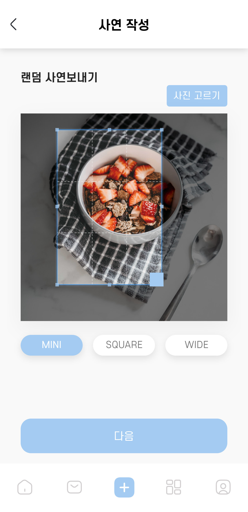 |  | 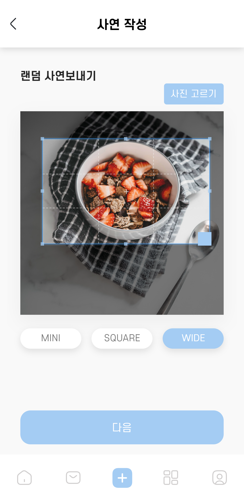 |
| -------------------------------------------- | -------------------------------------------- | -------------------------------------------- |

- 업로드된 사진은 MINI, SQUARE, WIDE, 3가지 종류 중 하나의 비율로 편집하여 `사연`으로 보낼 수 있습니다. 이는 이후 폴라로이드 프레임의 크기를 결정합니다.
    - MINI: 세로가 조금 더 긴 폴라로이드 프레임이 선택됩니다.
    - SQUARE: 정방형 폴라로이드 프레임이 선택됩니다.
    - WIDE: 가로가 조금 더 긴 폴라로이드 프레임이 선택됩니다.
- 프레임을 직접 움직이거나, 드래그를 통해 크기를 조절할 수 있습니다.

## 6-3. 유해 사진 업로드 방지

- [Azure Computer Vision](https://docs.microsoft.com/ko-kr/azure/cognitive-services/computer-vision/quickstarts-sdk/image-analysis-client-library?tabs=visual-studio&pivots=programming-language-javascript)의 이미지 분석을 통해 사용자가 올린 사진이 유해 컨텐츠로 판별될 경우 안내 문구가 출력되어 다른 사진을 업로드 하도록 유도합니다.

## 6-2. 키워드 선택

| 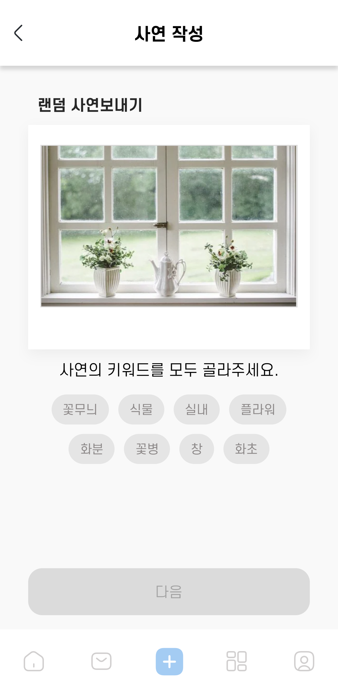 | 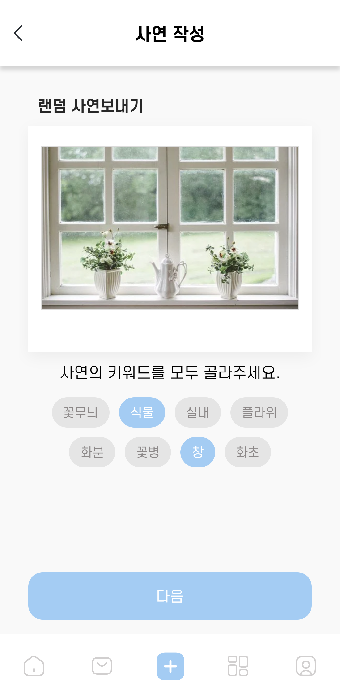 | 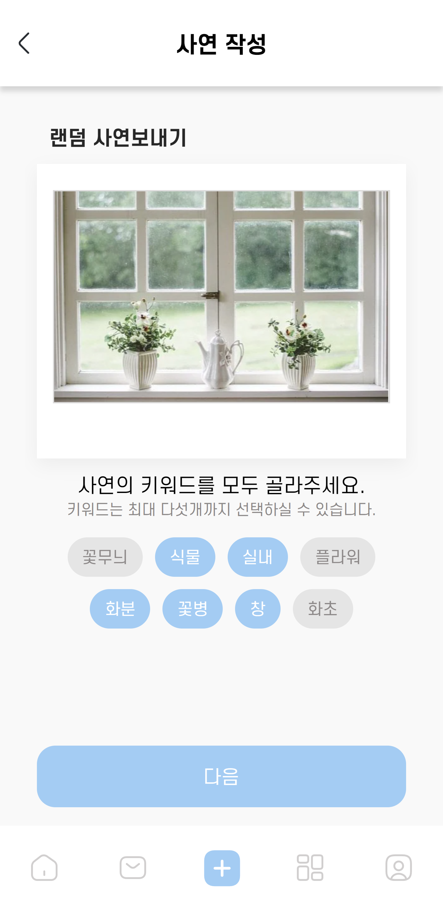 |
| -------------------------------------------- | -------------------------------------------- | -------------------------------------------- |

- [Azure Computer Vision](https://docs.microsoft.com/ko-kr/azure/cognitive-services/computer-vision/quickstarts-sdk/image-analysis-client-library?tabs=visual-studio&pivots=programming-language-javascript)을 이용하여 사용자가 업로드한 사진을 분석합니다. 분석 결과 도출된 키워드는 한국어로 번역되서 사용자에게 보여집니다.
- 사용자는 키워드를 선택하여 해당 사진을 통해 전달하고자 하는 사연을 표현할 수 있습니다.
- 키워드는 최대 5개까지 선택 가능하며 5개를 선택했을 경우 최대 개수를 선택했다는 안내문구가 보여집니다.

## 6-3. 전송 방법 선택

- 전송 방법은 특정 사용자에게 답장을 보내는 경우에만 선택할 수 있습니다.

- `사연`은 사용자간 위치 정보를 바탕으로 거리에 비례하여 전달 시간이 늘어납니다.
- 사용자에게는 `사연`이 전달되는데 소요되는 시간을 변경할 수 있는 세 가지 선택지가 주어집니다.
    - 비둘기는 거리 기반 소요 시간보다 더 천천히 `사연`을 전달합니다.
    - 우체통은 거리 기반 소요 시간 뒤에 `사연`을 전달합니다.
    - 자전거는 거리 기반 소요 시간보다 더 빠르게 `사연`을 전달합니다.

## 6-4. 사연 확정

|            6-4-1. 랜덤 사연 확정             |            6-4-2. 답장 사연 확정             |            6-4-3. 사연 전송 완료             |
| :------------------------------------------: | :------------------------------------------: | :------------------------------------------: |
| 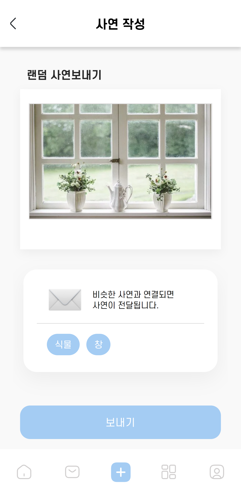 | 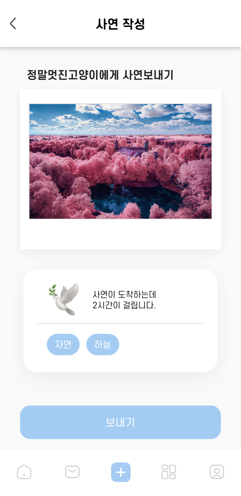 |  |

- 사용자가 업로드하여 편집한 사진과 선택한 키워드, 그리고 `사연` 전달에 걸리는 시간을 다시 한 번 확인할 수 있습니다.

- 돌아가기 버튼 클릭 또는 다이얼로그 창을 닫을 시 랜덤 사연을 작성했던 경우 메인 페이지로 리다이렉트 됩니다. 답장 사연을 작성했던 경우 사연 대화 목록 페이지로 리다이렉트 됩니다.

 

# 7. 사연함 페이지

|               7-1. 받은 사연함               |               7-2. 보낸 사연함               |                7-3. 사연 확대                |
| :------------------------------------------: | :------------------------------------------: | :------------------------------------------: |
|  |  | 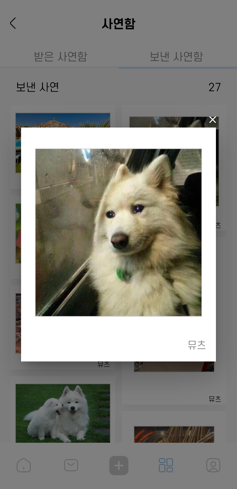 |

- 사연함에서 사용자가 현재까지 보낸 `사연`과 받았던 `사연`을 한눈에 모아볼 수 있습니다. `사연`은 최근 순으로 정렬되어 표시됩니다.
- 총 몇 개의 `사연`을 주고받았는지 그 개수가 표시됩니다.
- 각각의 `사연`은 클릭하여 확대가 가능합니다.

# 8. 내 정보 페이지

- 프로필 사진 수정, 닉네임 수정, 비밀번호 수정, 로그아웃 그리고 회원탈퇴 기능을 이용할 수 있습니다.

## 8-1. 내 정보 수정

| 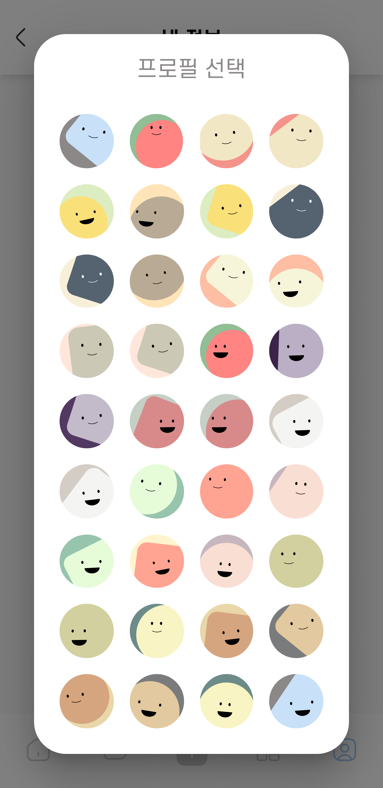 | 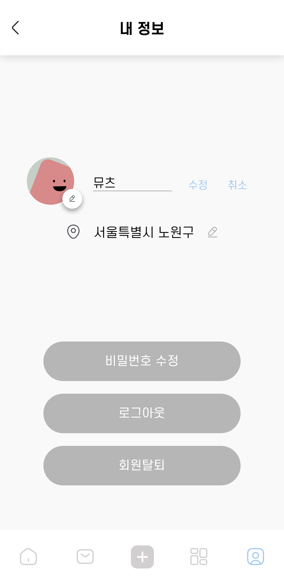 |  |
| -------------------------------------------- | -------------------------------------------- | -------------------------------------------- |

- 프로필 수정시 프로필 선택 다이얼로그가 등장하며 원하는 프로필 사진을 선택하면 수정됩니다.
- 닉네임과 위치 정보를 간편하게 수정할 수 있습니다.

|              8-2. 비밀번호 수정              |                8-3. 로그아웃                 |                8-4. 회원 탈퇴                |
| :------------------------------------------: | :------------------------------------------: | :------------------------------------------: |
| 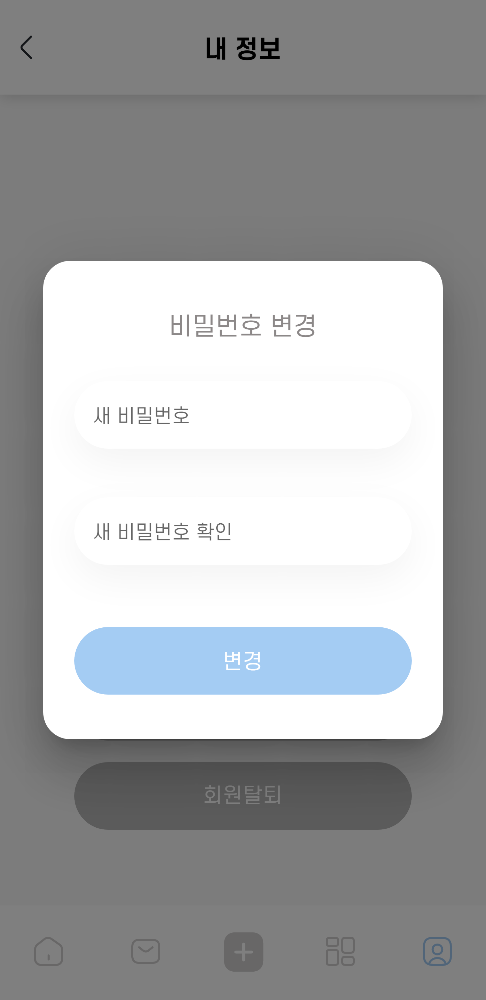 | 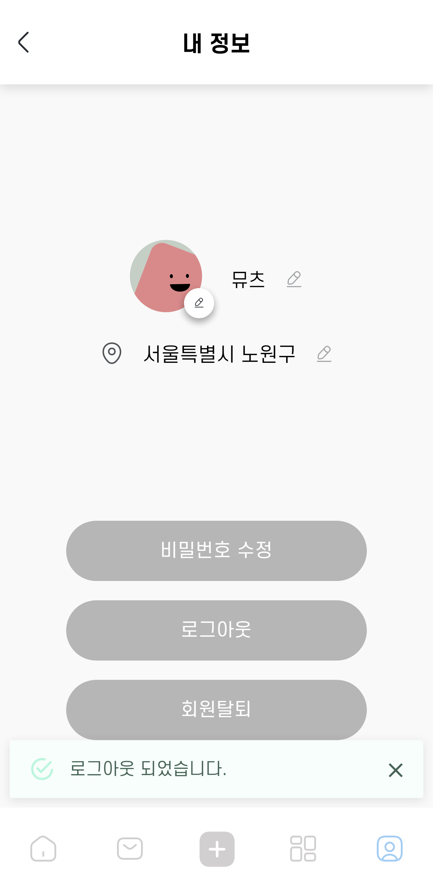 | 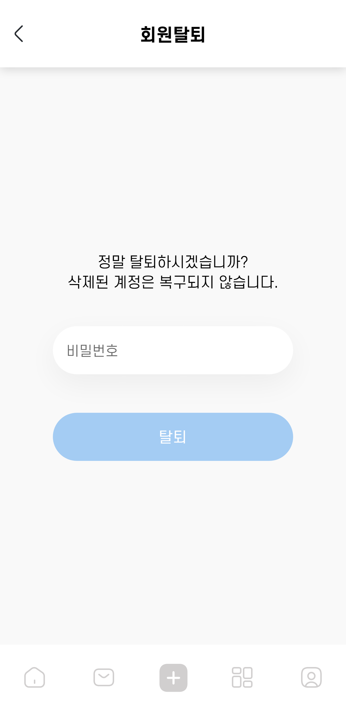 |

- 비밀번호 수정시 비밀번호 변경 다이얼로그가 등장하며 변경할 비밀번호와 비밀번호 확인을 동일하게 입력하면 비밀번호 수정이 완료됩니다.
- 로그아웃 버튼을 누르면 안내 문구가 표시되고 이후 로그인 페이지로 리다이렉트됩니다.
- 회원탈퇴 버튼을 누르면 회원탈퇴 페이지로 이동합니다. 현재 비밀번호를 다시 입력해야 탈퇴 기능을 이용할 수 있으며 비밀번호가 틀리면 탈퇴할 수 없습니다. 탈퇴시 사용자는 로그인 페이지로 리다이렉트됩니다.
